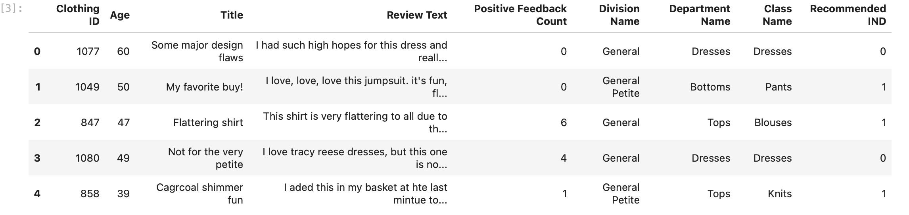
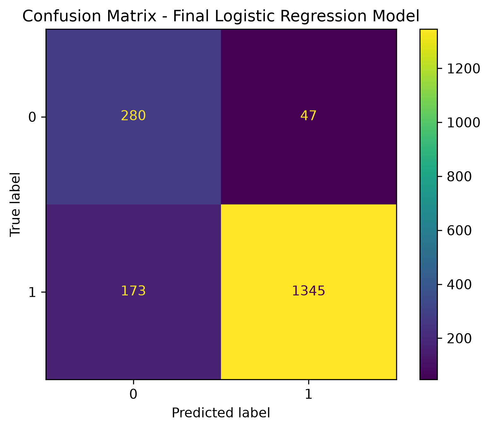

# Data Science Pipeline

This project builds an end-to-end machine learning pipeline to predict whether a customer will recommend a clothing product based on review text and additional customer and product features.

The workflow includes data exploration, preprocessing, NLP feature engineering, model training, hyperparameter tuning, model comparison, final model selection, and evaluation on held-out test data.

### Dataset Preview

The dataset contains customer reviews together with numerical, categorical, and text-based features used to predict the `Recommended IND` target.

<p align="center">
  
</p>

### Final Model Result

After training and comparing the candidate models, the final model was selected based on its evaluation performance on the test data.

<p align="center">
  
</p>

## Getting Started

The project can be run locally using Python and Jupyter Notebook. Follow the steps below to set up an isolated environment and install the required dependencies.

### Prerequisites

Before installing the project dependencies, make sure the following are available:

- Python 3.14.6
- pip
- A local terminal or command-line interface

You can verify Python and pip using:

```bash
python3 --version
python3 -m pip --version
```

If Python is not installed, install it before continuing. Anaconda can also be used as an optional Python distribution and environment manager.

>This project was developed and tested with Python 3.14.6. For maximum reproducibility and consistent results, use the same Python version.

### Dependencies

The project uses the following main dependencies:

- Python 3.14.6
- pandas 3.0.5
- NumPy 2.5.2
- scikit-learn 1.9.0
- spaCy 3.8.13
- Matplotlib 3.11.1
- Jupyter Notebook 7.6.2
- spaCy English model: `en_core_web_sm`

### Installation

1. Open a terminal and navigate to the directory where you want to download the project.

2. Clone the repository:

   ```bash
   git clone https://github.com/Alaa-1989/dsnd-pipelines-project.git
   ```

3. Navigate to the project directory:

   ```bash
   cd dsnd-pipelines-project
   ```

4. Create a virtual environment:

   ```bash
   python3 -m venv .venv
   ```

5. Activate the virtual environment:

   **macOS / Linux**
   ```bash
   source .venv/bin/activate
   ```

   **Windows**
   ```bash
   .venv\Scripts\Activate.ps1
   ```

6. Upgrade pip:

   ```bash
   python -m pip install --upgrade pip
   ```

7. Install the required project dependencies:

   ```bash
   python -m pip install -r requirements.txt
   ```

8. Install the spaCy English language model:

   ```bash
   python -m spacy download en_core_web_sm
   ```

9. Start Jupyter Notebook from the terminal:

   ```bash
   jupyter notebook
   ```

10. In Jupyter Notebook, open `Project_Data_Science_Pipeline.ipynb` and run the notebook cells from top to bottom.

### Troubleshooting

If the notebook becomes slow, unresponsive, or difficult to open because of saved cell outputs, you can clear all notebook outputs directly from the terminal without opening Jupyter:

```bash
jupyter nbconvert \
  --to notebook \
  --ClearOutputPreprocessor.enabled=True \
  --inplace \
  Project_Data_Science_Pipeline.ipynb
```
This removes saved cell outputs only. It does not remove notebook code, Markdown cells, or the notebook structure.

## Project Workflow

Run `Project_Data_Science_Pipeline.ipynb` from top to bottom.

The notebook follows an end-to-end data science pipeline that:

1. Loads and explores the review dataset.
2. Splits the data into training and test sets.
3. Preprocesses numerical, categorical, and text features.
4. Applies NLP techniques using spaCy, including lemmatization and part-of-speech feature engineering.
5. Uses TF-IDF to transform text features.
6. Builds classification pipelines using Logistic Regression and Random Forest.
7. Performs hyperparameter tuning.
8. Evaluates the trained models on the test data using classification metrics.
9. Compares the performance of the trained models.
10. Selects the final model based on the evaluation results.
11. Visualizes the final model's performance using evaluation plots.
12. Summarizes the results and presents the final project conclusion.

## Project Instructions

The project deliverables include:

- `Project_Data_Science_Pipeline.ipynb` 
Complete data science pipeline, including data exploration, preprocessing, NLP feature engineering, model training, hyperparameter tuning, and evaluation.
- `data/reviews.csv`
Dataset used by the project.
- `images/outputs`
  README images and selected model output screenshots
- `requirements.txt`
Python package versions required to reproduce the project environment.
- `README.md`
Project documentation and setup instructions.
- `LICENSE.txt`
License information provided with the project materials.

## Project Structure

```text
dsnd-pipelines-project/
├── data/
│   └── reviews.csv
├── images/
│   ├── dataset_preview.png
│   ├── final_model_result.png
│   └── outputs/
│       ├── logistic_regression_baseline_evaluation.png
│       ├── logistic_regression_tuned_evaluation.png
│       ├── random_forest_baseline_evaluation.png
│       ├── random_forest_tuned_evaluation.png
│       └── model_comparison.png
├── Project_Data_Science_Pipeline.ipynb
├── README.md
├── requirements.txt
├── LICENSE.txt
└── .gitignore
```

## Built With

### Core Tools
- Python
- Jupyter Notebook
- pandas
- NumPy
- Matplotlib
- spaCy
- scikit-learn

### Data Preprocessing & Pipeline
- BaseEstimator
- TransformerMixin
- ColumnTransformer
- Pipeline
- SimpleImputer
- MinMaxScaler
- OneHotEncoder

### Natural Language Processing
- spaCy English model (`en_core_web_sm`)
- TfidfVectorizer
- Lemmatization
- Part-of-Speech (POS) Tagging
- Custom SpacyLemmatizer
- Custom AdjectiveCounter

### Machine Learning Models
- LogisticRegression
- RandomForestClassifier

### Model Selection & Tuning
- train_test_split
- RandomizedSearchCV

### Model Evaluation
- accuracy_score
- precision_score
- recall_score
- f1_score
- classification_report
- confusion_matrix
- ConfusionMatrixDisplay

## Acknowledgments

- Udacity — Starter project materials and project guidance.

## License

See `LICENSE.txt` for the license information associated with the project materials provided by Udacity.

## Author

Alaa Alaboud — Project implementation, machine learning pipeline development, NLP feature engineering, model experimentation, evaluation, and documentation.